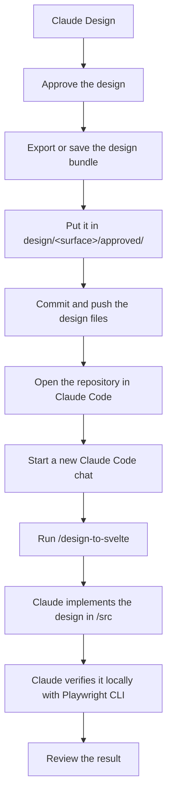

# veche.design

The public veche.design website and UI prototype for the future product.

The production application is built with SvelteKit. Design exports are kept separately under `/design` and are used as reference material when implementing approved UI changes.

## Design to Svelte workflow

Use Claude Design to explore and approve the visual design, then hand the approved result to Claude Code for implementation in the production SvelteKit application.



### 1. Create and approve the design

Work in Claude Design as usual. The GitHub connection can be used there as context for the existing veche.design codebase and visual system.

Once the design is approved, export or save the complete design bundle. If it is downloaded as an archive, unpack it first.

Do not clean up or convert the generated HTML, CSS, JavaScript, or assets manually.

### 2. Put the approved design in the repository

Place the complete exported design under:

```text
design/<surface>/approved/
```

For example:

```text
design/homepage/approved/
├── index.html
├── styles.css
├── assets/
├── reference.png
└── notes.md
```

Not every export will contain all of these files. Keep whatever Claude Design produced that is useful for understanding the approved result.

Use `design/<surface>/explorations/` only for alternatives that are still worth keeping. Normal version history belongs in Git rather than in `v1`, `v2`, `v3` folders.

Commit and push the design files before starting the implementation handoff.

### 3. Implement it with Claude Code

Open the repository in Claude Code and start a new chat.

Run:

```text
/design-to-svelte Implement the approved design from design/<surface>/approved into the production SvelteKit site.
```

For example:

```text
/design-to-svelte Implement the approved design from design/homepage/approved into the production SvelteKit site.
```

The `design-to-svelte` skill handles the implementation workflow. It treats the exported design as reference material, reuses the existing SvelteKit components/styles/localization, writes production code under `/src`, starts the local development server when needed, and performs browser verification with Playwright CLI.

The files under `/design` are never the production source of truth. Production UI remains under `/src`.

## Commands

Open **Terminal → New Terminal** in VS Code and make sure the terminal is in the repository root before running these commands.

- `git checkout <branch-name>` — switch to an existing branch.

  For example, to try the current design-to-Svelte workflow branch:

  ```sh
  git checkout feat/design-to-svelte-skill
  ```

- `npm run dev` — run the local development server.
- `npm run format` — format all files before Git push/sync.
- `./scripts/push-update.sh "<comment>"` — format and push changes to the current branch.
- `./scripts/kirill.sh` — pull the latest changes, install dependencies, build, and run the local server.
